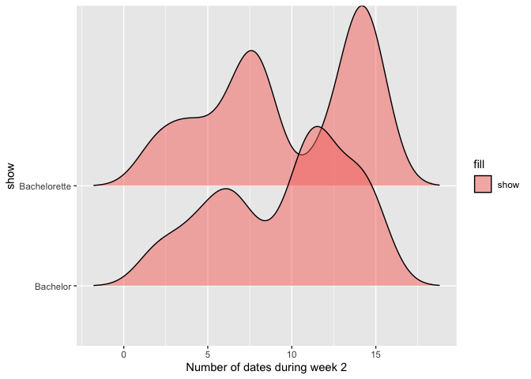
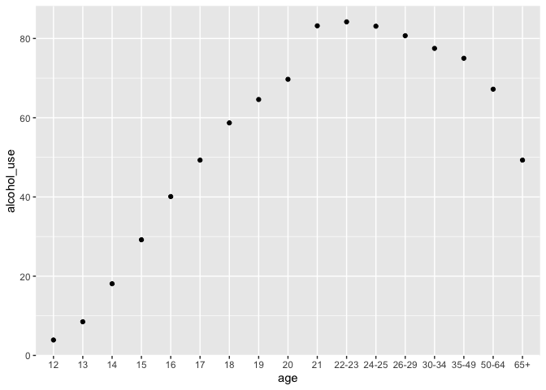
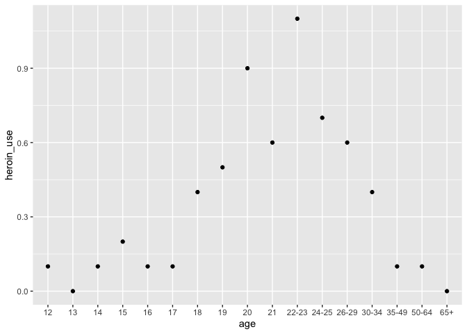
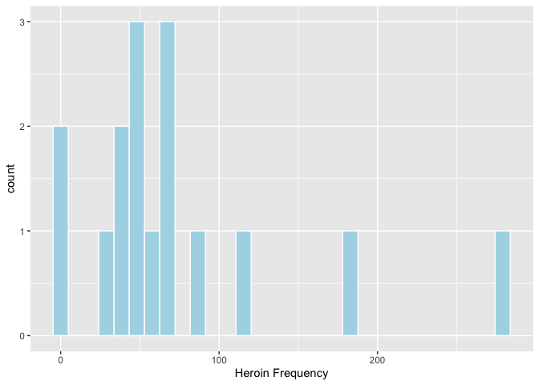

Names: Natalie, Zoe, and Aiym


```r
bachelorette_data <- bachelorette
drug_use <- drug_use
```


```r
ggplot(data = bachelorette_data) +
    geom_bar(mapping = (aes(x = season, fill = factor(show), postion = "fill")))+
  facet_wrap(~show)
```

```
## Warning: Ignoring unknown aesthetics: postion
```

<!-- -->
There are 8 more seasons of the Bachelor than the Bachelorette.


```r
ggplot(data = bachelorette_data) +
    geom_density_ridges(aes(x = dates_2, y = show, fill = "show"), alpha=.5)+
  xlab("Number of dates during week 2")
```

```
## Picking joint bandwidth of 1.26
```

```
## Warning: Removed 394 rows containing non-finite values
## (stat_density_ridges).
```

<!-- -->
Contestants on the Bachelorette go on more dates during week 2 than contestants on the Bachelor. 


```r
ggplot(data = drug_use) +
    geom_point(aes(x = age, y = alcohol_use))
```

<!-- -->
There is an increase in alcohol use beginning in the late teens which continues until the age of 21-23. After age 23, alcohol use then beings to decrease as age increases.


```r
ggplot(data = drug_use) +
    geom_point(aes(x = age, y = heroin_use))
```

<!-- -->
Heroin use is low among young teens and adults over 35. It is highest for people in their early 20's.


```r
ggplot(data = drug_use) +
    geom_histogram(aes(x = heroin_freq), fill = "lightblue", color= "white", bins = 30)+
  xlab("Heroin Frequency")
```

```
## Warning: Removed 1 rows containing non-finite values (stat_bin).
```

<!-- -->
Most heroin users have used the drug between 25-75 times and only a small number have used heroin more than 100 times. 
