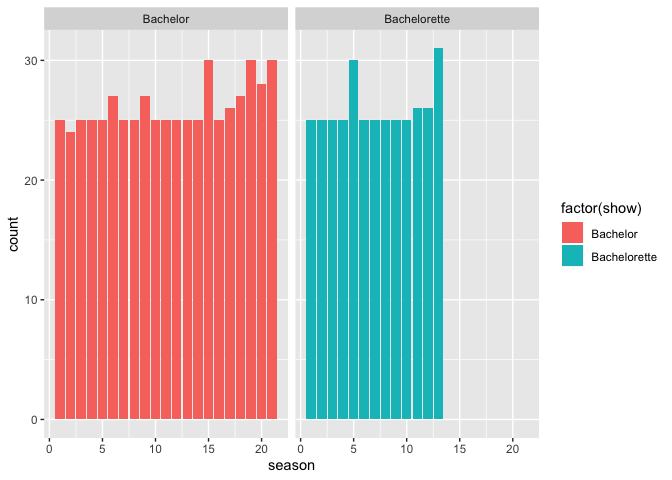
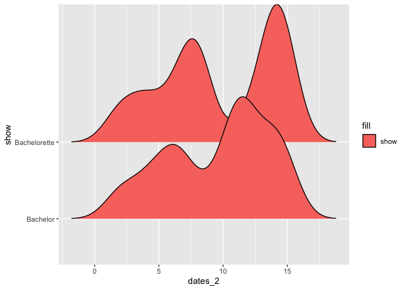
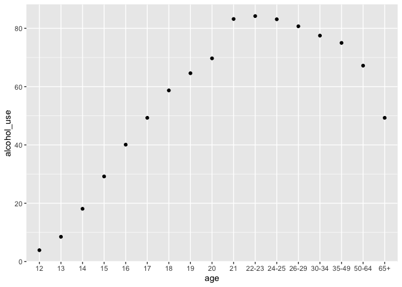
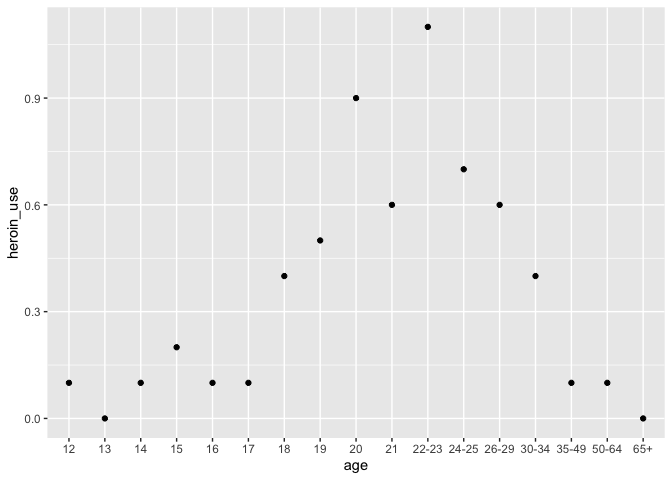
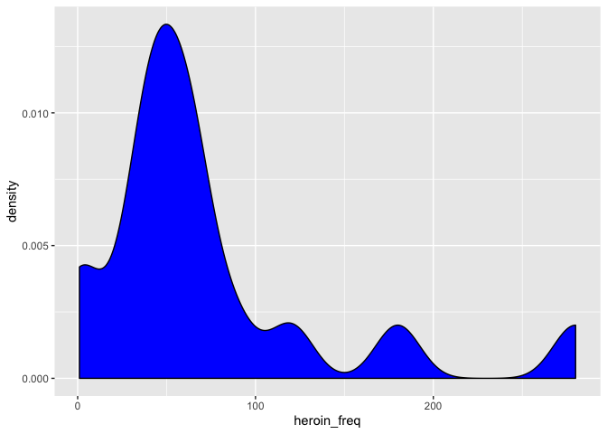

```r
bachelorette_data <- bachelorette
drug_use <- drug_use
```


```r
ggplot(data = bachelorette_data) +
    geom_bar(mapping = (aes(x = season, fill = factor(show), postion = "fill")))+
  facet_wrap(~show)
```

```
## Warning: Ignoring unknown aesthetics: postion
```

<!-- -->

```r
ggplot(data = bachelorette_data) +
    geom_density_ridges(aes(x = dates_2, y = show, fill = "show"))
```

```
## Picking joint bandwidth of 1.26
```

```
## Warning: Removed 394 rows containing non-finite values
## (stat_density_ridges).
```

<!-- -->


```r
ggplot(data = drug_use) +
    geom_point(aes(x = age, y = alcohol_use))
```

<!-- -->

```r
ggplot(data = drug_use) +
    geom_point(aes(x = age, y = heroin_use))
```

<!-- -->

```r
ggplot(data = drug_use) +
    geom_density(aes(x = heroin_freq), fill = "blue")
```

```
## Warning: Removed 1 rows containing non-finite values (stat_density).
```

<!-- -->

